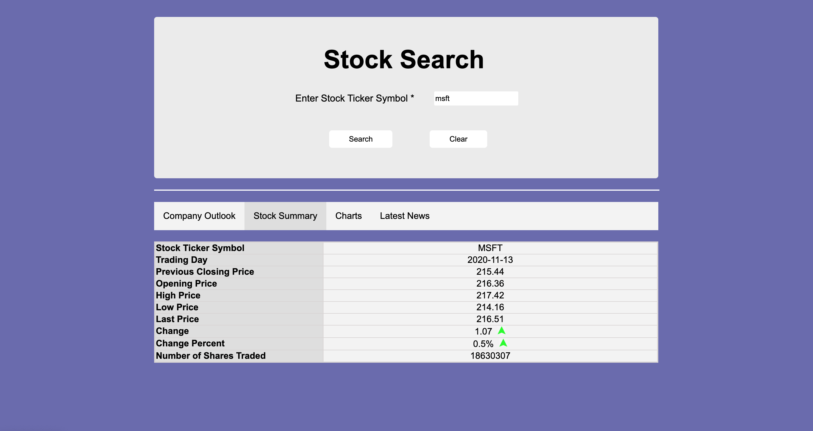

# Python Flask based Stock application

A website developed as part of CSCI 571 - Web Technologies @ USC

<h2>Project Goals</h2>
<ul>
  <li>Become familiar with dynamic HTML markup</li>
  <li>Develop frontend and backend of an application - and learn to tie them up</li>
  <li>
    Become familiar with python programming
    <ul>
      <li>Basic structures: Lists, Dictionaries, Sets, etc</li>
      <li>Sending/receiving and parsing JSONs</li>
      <li>Using requests module to perform HTTP requests</li>
    </ul>
  </li>
  <li>Learn <a href="https://flask.palletsprojects.com/">Flask</a>, which is a micro web framework written in Python</li>
  <li>Adhering to good standards such as storing API keys/secrets in hidden files and not checking them to Git</li>
  <li>Use Javascript on the frontend along with <a href="https://developer.mozilla.org/en-US/docs/Web/API/XMLHttpRequest">XMLHttpRequest</a> to make asynchronous requests to the backend</li>
  <li>Host/Deploy the entire site to <a href="https://azure.microsoft.com/en-us/">Azure</a></li>
  <li>Replicate the actual website (given as a set of images/blueprints) down to pixels, alignments, and font-styles</li>
</ul>

<h2>Consume REST API's</h2>
<a href="https://api.tiingo.com/">Tiingo API</a>  
 
<a href="https://newsapi.org/">News API</a>  
 

<h2>HighCharts Support</h2>
Use <a href="https://www.highcharts.com/">Highcharts</a> for displaying interactive charts regarding historical financial stock performance  
 
        
<h2>Screenshots of the developed website</h2>

Entry Page

Outlook Page

Summary Page

Charts Page

News Page

 

<h2>API response</h2>
The Flask backend also exposes data in the form of a REST API, which can be consumed by any other application (not just the above frontend javascript) 

